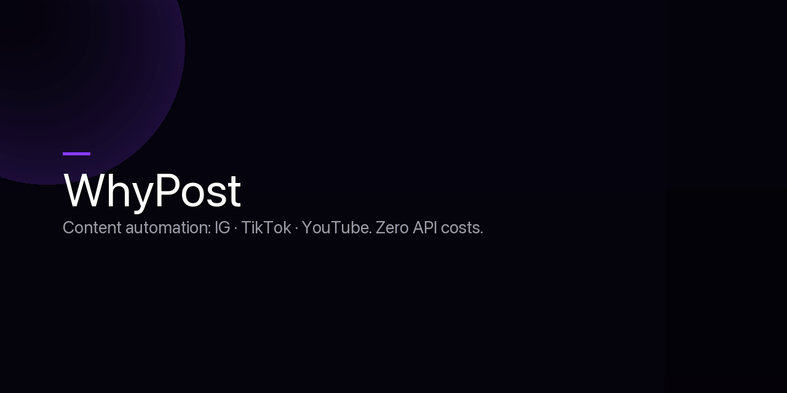
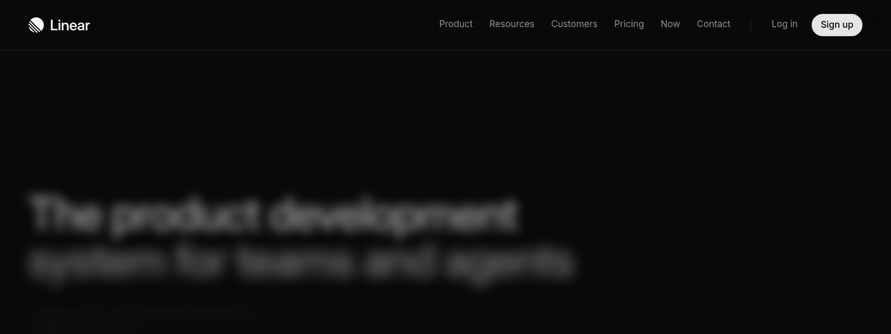

<p align="center">
  
</p>

<p align="center">
  
  
  
  
  
</p>

<br/>

> Sistema di content automation per Instagram, TikTok e YouTube Shorts. Gira in locale sul Mac, usa Claude Pro headless, zero costi extra. 10 cron job attivi, 7 pagine UI, pipeline completa dalla ricerca al publish.

---

## Come funziona

```
EXEL (idea engine) → Script Writer → Remotion (video) → Publisher
       ↑                                                     ↓
  Reddit / trend                                    IG · TikTok · YouTube
```

| Agente | Ruolo |
|--------|-------|
| **EXEL** | Ricerca idee virali da Reddit e trend |
| **Script Writer** | Genera script ottimizzati per piattaforma |
| **CLACK Director** | Produce video con Remotion + karaoke captions |
| **Publisher** | Pubblica automaticamente sui 3 canali |
| **Calendar Agent** | Pianifica settimane e gestisce la queue |

---

<p align="center">
  
</p>

---

## Features

- **10 cron job attivi** — pubblica ogni giorno senza intervento manuale
- **Remotion video engine** — video con karaoke captions sincronizzate al ms
- **Mission Control** — dashboard React per monitorare tutto in real-time
- **B-roll automatico** — Pexels + Pixabay fallback
- **Multi-piattaforma** — formato e metadata ottimizzati per ogni canale
- **Zero costi AI** — usa Claude Code CLI (Claude Pro), nessun API key Anthropic

---

## Stack

- **Backend**: Python + Flask su `:5174`
- **Frontend**: React + Vite (Mission Control, 7 pagine)
- **Video**: Remotion + FFmpeg
- **AI**: Claude Code CLI · Gemini Flash · Groq
- **Storage**: SQLite + JSON queue locale
- **Scheduling**: crontab macOS

---

## Setup

```bash
git clone https://github.com/OfficialWhyEd/WhyPost
cd WhyPost

python3 -m venv venv && source venv/bin/activate
pip install -r requirements.txt

cd web && npm install

cp .env.example .env   # configura IG_ACCESS_TOKEN, TT_ACCESS_TOKEN, PEXELS_API_KEY

# Avvia
python3 server/app.py &
cd web && npm run dev
```

---

## Struttura

```
WhyPost/
├── agents/           # EXEL, ScriptWriter, CLACK, Publisher, Calendar
├── server/           # Flask API
├── web/              # React Mission Control (7 pagine)
├── remotion/         # Template video Remotion
├── prompts/          # System prompt per ogni agente
├── data/             # Queue, state, DB locale
└── scripts/          # Utility e setup
```

---

<p align="center">Built by <a href="https://github.com/OfficialWhyEd">@whyed</a> · macOS · local-first · no Anthropic API key needed</p>
