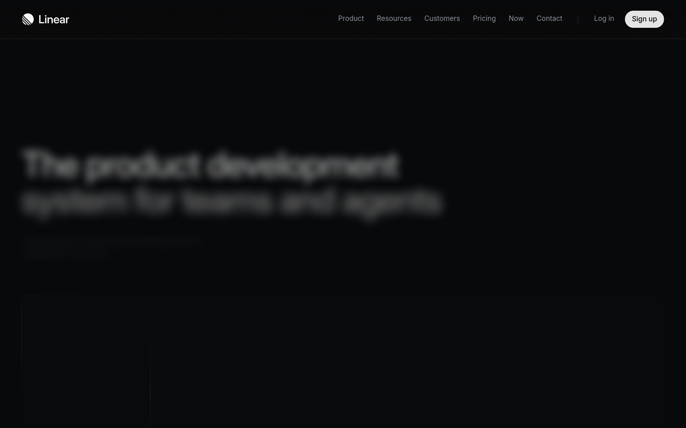

# linear Design System

You are building UI for **linear**. Dark-themed, cool palette, sans-serif typography (Inter Variable), compact density on a 4px grid, expressive motion.

## Visual Reference

**IMPORTANT**: Study ALL screenshots below before writing any UI. Match colors, typography, spacing, layout, and motion exactly as shown.

### Homepage



> Read `references/DESIGN.md` for full token details.

## Design Philosophy

- **Layered depth** — use shadow tokens to create a sense of physical layering. Each elevation level has a specific shadow.
- **Gradient accents** — gradients are used thoughtfully for emphasis, not decoration.
- **Single typeface** — Inter Variable carries all text. Hierarchy comes from size, weight, and color — never font mixing.
- **compact density** — 4px base grid. Every dimension is a multiple of 4.
- **cool palette** — the color temperature runs cool, matching the sans-serif typography.
- **Restrained accent** — `#828fff` is the only pop of color. Used exclusively for CTAs, links, focus rings, and active states.
- **Expressive motion** — animations are an integral part of the experience. Use spring physics and layout animations.

## Color System

### Core Palette

| Role | Token | Hex | Use |
|------|-------|-----|-----|
| Background | `--background` | `#080808` | Page/app background |
| Surface | `--surface` | `#101213` | Cards, panels, modals |
| Text Primary | `--text-primary` | `#ffffff` | Headings, body text |
| Text Muted | `--text-muted` | `#191d20` | Captions, placeholders |
| Accent | `--accent` | `#828fff` | CTAs, links, focus rings |
| Border | `--border` | `#28282c` | Dividers, card borders |

### Status Colors

| Status | Hex | Use |
|--------|-----|-----|
| Danger | `#eb5757` | Errors, destructive actions |

### Extended Palette

- **color-bg-tertiary:** `#f4f2f4` — Light surface or highlight color
- **color-text-quaternary:** `#62666d`
- **color-teal:** `#02b8cc`
- **color-button-invert-bg:** `#e2e4e7` — Light surface or highlight color
- **color-indigo:** `#5e6ad2`
- `#585a5c`
- **color-text-tertiary:** `#6f6e77`
- **color-text-quaternary:** `#86848d`

### CSS Variable Tokens

```css
--layer-popover: 600;
--border-hairline: 1px;
--border-hairline: 0.5px;
--header-border: rgba(255,255,255,0.08);
--color-bg-primary: #08090a;
--color-bg-secondary: #1c1c1f;
--color-border-primary: #23252a;
--color-border-secondary: #34343a;
--color-border-tertiary: #3e3e44;
--color-border-translucent: rgba(255,255,255,0.05);
--color-border-translucent-strong: rgba(255,255,255,0.08);
--color-text-primary: #f7f8f8;
--color-text-secondary: #d0d6e0;
--color-link-primary: #828fff;
--color-overlay-primary: rgba(0,0,0,0.85);
--color-line-primary: #37393a;
--color-line-secondary: #202122;
--color-fg-primary: #f7f8f8;
--color-fg-secondary: #d0d6e0;
--color-accent: #7170ff;
```

## Typography

### Font Stack

- **Inter Variable** — Heading 1, Heading 2, Heading 3, Body, Caption
- **Berkeley Mono** — Code

### Font Sources

```css
@font-face {
  font-family: "Inter Variable";
  src: url("fonts/InterVariable-100.woff2") format("woff2");
  font-weight: 100;
}
@font-face {
  font-family: "Berkeley Mono";
  src: url("fonts/BerkeleyMono-100.woff2") format("woff2");
  font-weight: 100;
}
```

### Type Scale

| Role | Family | Size | Weight |
|------|--------|------|--------|
| Heading 1 | Inter Variable | 64px | 700 |
| Heading 2 | Inter Variable | 56px | 700 |
| Heading 3 | Inter Variable | 40px | 700 |
| Body | Inter Variable | 14px | 400 |
| Caption | Inter Variable | 13px | 400 |
| Code | Berkeley Mono | 14px | 400 |

### Typography Rules

- All text uses **Inter Variable** — never add another font family
- Max 3-4 font sizes per screen
- Headings: weight 600-700, body: weight 400
- Use color and opacity for text hierarchy, not additional font sizes
- Line height: 1.5 for body, 1.2 for headings

## Spacing & Layout

### Base Grid: 4px

Every dimension (margin, padding, gap, width, height) must be a multiple of **4px**.

### Spacing Scale

`2, 4, 6, 8, 10, 12, 14, 16, 18, 20, 22, 24` px

### Spacing as Meaning

| Spacing | Use |
|---------|-----|
| 4-8px | Tight: related items (icon + label, avatar + name) |
| 12-16px | Medium: between groups within a section |
| 24-32px | Wide: between distinct sections |
| 48px+ | Vast: major page section breaks |

### Border Radius

Scale: `.2em, .3em, 1px, 2px, 3px, 4px, 5px, 5, 6px, 7px, 8px, 10px, 12px, 14px, 16px, 20px, 22px, 24px, 72px, 100%, 400px, 999px, inherit, clamp(4px,1cqw,8px)`
Default: `12px`

### Container

Max-width: `1280px`, centered with auto margins.

### Breakpoints

| Name | Value |
|------|-------|
| sm | 560px |
| sm | 640px |
| md | 641px |
| md | 700px |
| md | 768px |
| lg | 769px |
| lg | 928px |
| lg | 1024px |
| xl | 1025px |
| xl | 1140px |
| xl | 1240px |
| xl | 1280px |
| 2xl | 1281px |
| 2xl | 1420px |
| 2xl | 1440px |
| 2xl | 1536px |
| 2xl | 1601px |

Mobile-first: design for small screens, layer on responsive overrides.

## Component Patterns

### Card

```css
.card {
  background: #101213;
  border: 1px solid #28282c;
  border-radius: 12px;
  padding: 16px;
  box-shadow: 0 0 4px rgba(0,0,0,.5);
}
```

```html
<div class="card">
  <h3>Card Title</h3>
  <p>Card content goes here.</p>
</div>
```

### Button

```css
/* Primary */
.btn-primary {
  background: #828fff;
  color: #ffffff;
  border-radius: 12px;
  padding: 8px 16px;
  font-weight: 500;
  transition: opacity 150ms ease;
}
.btn-primary:hover { opacity: 0.9; }

/* Ghost */
.btn-ghost {
  background: transparent;
  border: 1px solid #28282c;
  color: #ffffff;
  border-radius: 12px;
  padding: 8px 16px;
}
```

```html
<button class="btn-primary">Get Started</button>
<button class="btn-ghost">Learn More</button>
```

### Input

```css
.input {
  background: #080808;
  border: 1px solid #28282c;
  border-radius: 12px;
  padding: 8px 12px;
  color: #ffffff;
  font-size: 14px;
}
.input:focus { border-color: #828fff; outline: none; }
```

```html
<input class="input" type="text" placeholder="Search..." />
```

### Badge / Chip

```css
.badge {
  display: inline-flex;
  align-items: center;
  padding: 4px 8px;
  border-radius: 9999px;
  font-size: 12px;
  font-weight: 500;
  background: #101213;
  color: #191d20;
}
```

```html
<span class="badge">New</span>
<span class="badge">Beta</span>
```

### Modal / Dialog

```css
.modal-backdrop { background: rgba(0, 0, 0, 0.6); }
.modal {
  background: #101213;
  border: 1px solid #28282c;
  border-radius: clamp(4px,1cqw,8px);
  padding: 24px;
  max-width: 480px;
  width: 90vw;
  box-shadow: 0 0 0 1px rgba(0,0,0,.08),0 2px 2px rgba(0,0,0,.04),0 8px 16px -4px rgba(0,0,0,.04);
}
```

```html
<div class="modal-backdrop">
  <div class="modal">
    <h2>Dialog Title</h2>
    <p>Dialog content.</p>
    <button class="btn-primary">Confirm</button>
    <button class="btn-ghost">Cancel</button>
  </div>
</div>
```

### Table

```css
.table { width: 100%; border-collapse: collapse; }
.table th {
  text-align: left;
  padding: 8px 12px;
  font-weight: 500;
  font-size: 12px;
  color: #191d20;
  text-transform: uppercase;
  letter-spacing: 0.05em;
  border-bottom: 1px solid #28282c;
}
.table td {
  padding: 12px;
  border-bottom: 1px solid #28282c;
}
```

```html
<table class="table">
  <thead><tr><th>Name</th><th>Status</th><th>Date</th></tr></thead>
  <tbody>
    <tr><td>Item One</td><td>Active</td><td>Jan 1</td></tr>
    <tr><td>Item Two</td><td>Pending</td><td>Jan 2</td></tr>
  </tbody>
</table>
```

### Navigation

```css
.nav {
  display: flex;
  align-items: center;
  gap: 8px;
  padding: 12px 16px;
  border-bottom: 1px solid #28282c;
}
.nav-link {
  color: #191d20;
  padding: 8px 12px;
  border-radius: 12px;
  transition: color 150ms;
}
.nav-link:hover { color: #ffffff; }
.nav-link.active { color: #828fff; }
```

```html
<nav class="nav">
  <a href="/" class="nav-link active">Home</a>
  <a href="/about" class="nav-link">About</a>
  <a href="/pricing" class="nav-link">Pricing</a>
  <button class="btn-primary" style="margin-left: auto">Get Started</button>
</nav>
```

### Extracted Components

These components were found in the codebase:

**Button** (`html`)

**Navigation** (`html`)

## Page Structure

The following page sections were detected:

- **Navigation** — Top navigation bar (9 items)
- **Hero** — Hero section (detected from heading structure)
- **Faq** — FAQ/accordion section
- **Footer** — Page footer with links and info (40 items)

When building pages, follow this section order and structure.

## Animation & Motion

This project uses **expressive motion**. Animations are part of the design language.

### CSS Animations

- `x11lpqvw-B`
- `x9xrbjn-B`
- `x18re5ia-B`
- `xekv6nw-B`
- `x4yq7nq-B`

### Motion Tokens

- **Duration scale:** `0s`, `0ms`, `.1s`, `.15s`, `.2s`, `.25s`, `.3s`, `.35s`, `.7s`, `1s`, `1.8s`, `2s`, `2.5s`, `80ms`, `100ms`, `120ms`, `150ms`, `160ms`, `180ms`, `200ms`, `220ms`, `250ms`, `300ms`, `400ms`, `480ms`, `500ms`, `600ms`
- **Easing functions:** `ease-out`, `ease-in-out`, `ease`, `cubic-bezier(.4,0,.2,1)`, `cubic-bezier(.165,.84,.44,1)`, `linear`, `cubic-bezier(.2,.43,.16,1)`, `cubic-bezier(.43,.07,.59,.94)`, `cubic-bezier(.32,.72,0,1)`, `cubic-bezier(.16,1,.3,1)`

### Motion Guidelines

- **Duration:** Use values from the duration scale above. Short (0s) for micro-interactions, long (600ms) for page transitions
- **Easing:** Use `ease-out` as the default easing curve
- **Direction:** Elements enter from bottom/right, exit to top/left
- **Reduced motion:** Always respect `prefers-reduced-motion` — disable animations when set

## Depth & Elevation

### Shadow Tokens

- Subtle: `var(--shadow-tiny,var(--shadow-none)),0 0 0 1px var(--color-border-tertiary)`
- Subtle: `0 0 0 1px var(--xcx2ark) inset`
- Subtle: `0 0 0 1px var(--xcx2ark)`
- Subtle: `0 1px 2px rgba(0,0,0,.5)`
- Subtle: `0 0 0 1px var(--x1jmjcvw),var(--x10lzhmx)`
- Subtle: `0 0 0 1px var(--sx-cx2ark)`

### Z-Index Scale

`0, 1, 2, 3, 5, 10, 100, 500, 700, 706, 1100, 999999999999`

Use these exact values — never invent z-index values.

## Anti-Patterns (Never Do)

- **No blur effects** — no backdrop-blur, no filter: blur()
- **No zebra striping** — tables and lists use borders for separation
- **No invented colors** — every hex value must come from the palette above
- **No arbitrary spacing** — every dimension is a multiple of 4px
- **No extra fonts** — only Inter Variable and Berkeley Mono are allowed
- **No arbitrary border-radius** — use the scale: .2em, .3em, 1px, 2px, 3px, 4px, 5px, 5, 6px, 7px
- **No opacity for disabled states** — use muted colors instead

## Workflow

1. **Read** `references/DESIGN.md` before writing any UI code
2. **Pick colors** from the Color System section — never invent new ones
3. **Set typography** — Inter Variable, Berkeley Mono only, using the type scale
4. **Build layout** on the 4px grid — check every margin, padding, gap
5. **Match components** to patterns above before creating new ones
6. **Apply elevation** — use shadow tokens
7. **Validate** — every value traces back to a design token. No magic numbers.

## Brand Spec

- **Favicon:** `/favicon.ico`
- **Site URL:** `https://linear.app`
- **Brand color:** `#828fff`
- **Brand typeface:** Inter Variable

## Quick Reference

```
Background:     #080808
Surface:        #101213
Text:           #ffffff / #191d20
Accent:         #828fff
Border:         #28282c
Font:           Inter Variable
Spacing:        4px grid
Radius:         12px
Components:     7 detected
```

## When to Trigger

Activate this skill when:
- Creating new components, pages, or visual elements for linear
- Writing CSS, Tailwind classes, styled-components, or inline styles
- Building page layouts, templates, or responsive designs
- Reviewing UI code for design consistency
- The user mentions "linear" design, style, UI, or theme
- Generating mockups, wireframes, or visual prototypes

---

# Full Reference Files

> Every output file is embedded below. Claude has full design system context from /skills alone.

## Design System Tokens (DESIGN.md)

# linear DESIGN.md

> Auto-generated design system — reverse-engineered via static analysis by skillui.
> Frameworks: None detected
> Colors: 20 · Fonts: 2 · Components: 7
> Icon library: not detected · State: not detected
> Primary theme: dark · Dark mode toggle: no · Motion: expressive

## Visual Reference

**Match this design exactly** — study colors, fonts, spacing, and component shapes before writing any UI code.


---

## 1. Visual Theme & Atmosphere

This is a **dark-themed** interface with a cool tone. Depth is expressed through layered shadows and subtle surface color variation. Typography uses **Inter Variable** throughout — a clean, modern choice that maintains consistency. Spacing follows a **4px base grid** (compact density), with scale: 2, 4, 6, 8, 10, 12, 14, 16px. The accent color **#828fff** anchors interactive elements (buttons, links, focus rings). Motion is expressive — spring physics, layout animations, and staggered reveals are part of the visual language.

---

## 2. Color Palette & Roles

| Token | Hex | Role | Use |
|---|---|---|---|
| theme-color | `#080808` | background | Page background, darkest surface |
| card-bg | `#101213` | surface | Card and panel backgrounds |
| scrollbar-color | `#ffffff` | text-primary | Headings and body text |
| color-bg-secondary | `#191d20` | text-muted | Captions, placeholders, secondary info |
| color-border-secondary | `#383b3f` | text-muted | Captions, placeholders, secondary info |
| text-muted | `#9c9da1` | text-muted | Captions, placeholders, secondary info |
| color-text-secondary | `#d2d7de` | text-muted | Captions, placeholders, secondary info |
| color-text-secondary | `#b4bcd0` | text-muted | Captions, placeholders, secondary info |
| color-bg-quaternary | `#28282c` | border | Dividers, card borders, outlines |
| color-link-primary | `#828fff` | accent | CTAs, links, focus rings, active states |
| color-accent | `#7170ff` | accent | CTAs, links, focus rings, active states |
| color-red | `#eb5757` | danger | Error states, destructive actions |
| color-teal | `#02b8cc` | info | Informational highlights |
| color-bg-tertiary | `#f4f2f4` | unknown | Palette color |
| color-text-quaternary | `#62666d` | unknown | Palette color |
| color-button-invert-bg | `#e2e4e7` | unknown | Palette color |
| color-indigo | `#5e6ad2` | unknown | Palette color |
| unknown | `#585a5c` | unknown | Palette color |
| color-text-tertiary | `#6f6e77` | unknown | Palette color |
| color-text-quaternary | `#86848d` | unknown | Palette color |

### CSS Variable Tokens

```css
--layer-popover: 600;
--border-hairline: 1px;
--border-hairline: 0.5px;
--header-border: rgba(255,255,255,0.08);
--color-bg-primary: #08090a;
--color-bg-secondary: #1c1c1f;
--color-border-primary: #23252a;
--color-border-secondary: #34343a;
--color-border-tertiary: #3e3e44;
--color-border-translucent: rgba(255,255,255,0.05);
--color-border-translucent-strong: rgba(255,255,255,0.08);
--color-text-primary: #f7f8f8;
--color-text-secondary: #d0d6e0;
--color-link-primary: #828fff;
--color-overlay-primary: rgba(0,0,0,0.85);
--color-line-primary: #37393a;
--color-line-secondary: #202122;
--color-fg-primary: #f7f8f8;
--color-fg-secondary: #d0d6e0;
--color-accent: #7170ff;
```


---

## 3. Typography Rules

**Font Stack:**
- **Inter Variable** — Heading 1, Heading 2, Heading 3, Body, Caption
- **Berkeley Mono** — Code

**Font Sources:**

```css
@font-face {
  font-family: "Inter Variable";
  src: url("fonts/InterVariable-100.woff2") format("woff2");
  font-weight: 100;
}
@font-face {
  font-family: "Berkeley Mono";
  src: url("fonts/BerkeleyMono-100.woff2") format("woff2");
  font-weight: 100;
}
```

| Role | Font | Size | Weight |
|---|---|---|---|
| Heading 1 | Inter Variable | 64px | 700 |
| Heading 2 | Inter Variable | 56px | 700 |
| Heading 3 | Inter Variable | 40px | 700 |
| Body | Inter Variable | 14px | 400 |
| Caption | Inter Variable | 13px | 400 |
| Code | Berkeley Mono | 14px | 400 |

**Typographic Rules:**
- Use **Inter Variable** for all text — do not mix font families
- Maintain consistent hierarchy: no more than 3-4 font sizes per screen
- Headings use bold (600-700), body uses regular (400)
- Line height: 1.5 for body text, 1.2 for headings
- Use color and opacity for secondary hierarchy, not additional font sizes


---

## 4. Component Stylings

### Layout (1)

**Footer** — `html`

### Navigation (1)

**Navigation** — `html`

### Data Input (2)

**Button** — `html`
- Animation: 

**Input** — `html`
- State: :focus, :placeholder

### Media (3)

**Image** — `html`

**Icon** — `html`

**Map/Canvas** — `html`


---

## 5. Layout Principles

- **Base spacing unit:** 4px
- **Spacing scale:** 2, 4, 6, 8, 10, 12, 14, 16, 18, 20, 22, 24
- **Border radius:** .2em, .3em, 1px, 2px, 3px, 4px, 5px, 5, 6px, 7px, 8px, 10px, 12px, 14px, 16px, 20px, 22px, 24px, 72px, 100%, 400px, 999px, inherit, clamp(4px,1cqw,8px)
- **Max content width:** 1280px

**Spacing as Meaning:**
| Spacing | Use |
|---|---|
| 4-8px | Tight: related items within a group |
| 12-16px | Medium: between groups |
| 24-32px | Wide: between sections |
| 48px+ | Vast: major section breaks |


---

## 6. Depth & Elevation

### Flat — subtle depth hints

- `var(--shadow-tiny,var(--shadow-none)),0 0 0 1px var(--color-border-tertiary)`
- `0 0 0 1px var(--xcx2ark) inset`
- `0 0 0 1px var(--xcx2ark)`

### Raised — cards, buttons, interactive elements

- `0 0 4px rgba(0,0,0,.5)`
- `var(--x-boxShadow)`
- `var(--x10lzhmx)`

### Floating — dropdowns, popovers, modals

- `0 0 0 1px rgba(0,0,0,.08),0 2px 2px rgba(0,0,0,.04),0 8px 16px -4px rgba(0,0,0,.04)`
- `inset 0 0 12px 0 rgba(0,0,0,.2)`
- `0 4px 12px rgba(0,0,0,.15)`

### Overlay — full-screen overlays, top-level dialogs

- `0 12px 48px var(--xd1bcc1)`
- `0 0 32px 0 rgba(0,0,0,.4),0 0 0 1px #000`
- `0 9px 48px lch(0 0 0/.088),0 6px 24px lch(0 0 0/.11),0 1px 1px lch(0 0 0/.044)`

### Z-Index Scale

`0, 1, 2, 3, 5, 10, 100, 500, 700, 706, 1100, 999999999999`


---

## 7. Animation & Motion

This project uses **expressive motion**. Animations are an integral part of the experience.

### CSS Animations

- `@keyframes x11lpqvw-B`
- `@keyframes x9xrbjn-B`
- `@keyframes x18re5ia-B`
- `@keyframes xekv6nw-B`
- `@keyframes x4yq7nq-B`
- `@keyframes x1ph81ge-B`
- `@keyframes sx-hef49w-B`
- `@keyframes GitAutomationsIllustration_move__QFN_J`

### Animated Components

- **Button**: 

### Motion Guidelines

- Duration: 150-300ms for micro-interactions, 300-500ms for page transitions
- Easing: `ease-out` for enters, `ease-in` for exits
- Always respect `prefers-reduced-motion`


---

## 8. Do's and Don'ts

### Do's

- Use `#828fff` for interactive elements (buttons, links, focus rings)
- Use `#080808` as the primary page background
- Use **Inter Variable** for all UI text
- Follow the **4px** spacing grid for all margins, padding, and gaps
- Use the defined shadow tokens for elevation — see Section 6
- Use border-radius from the scale: .2em, .3em, 1px, 2px, 3px
- Reuse existing components from Section 4 before creating new ones

### Don'ts

- Don't introduce colors outside this palette — extend the design tokens first
- Don't mix font families — use Inter Variable consistently
- Don't use arbitrary spacing values — stick to multiples of 4px
- Don't create custom box-shadow values outside the system tokens
- Don't use arbitrary border-radius values — pick from the defined scale
- Don't duplicate component patterns — check Section 4 first
- Don't use backdrop-blur or blur effects

### Anti-Patterns (detected from codebase)

- No blur or backdrop-blur effects
- No zebra striping on tables/lists


---

## 9. Responsive Behavior

| Name | Value | Source |
|---|---|---|
| sm | 560px | css |
| sm | 640px | css |
| md | 641px | css |
| md | 700px | css |
| md | 768px | css |
| lg | 769px | css |
| lg | 928px | css |
| lg | 1024px | css |
| xl | 1025px | css |
| xl | 1140px | css |
| xl | 1240px | css |
| xl | 1280px | css |
| 2xl | 1281px | css |
| 2xl | 1420px | css |
| 2xl | 1440px | css |
| 2xl | 1536px | css |
| 2xl | 1601px | css |

**Approach:** Use `@media (min-width: ...)` queries matching the breakpoints above.


---

## 10. Agent Prompt Guide

Use these as starting points when building new UI:

### Build a Card

```
Background: #101213
Border: 1px solid #28282c
Radius: 12px
Padding: 16px
Font: Inter Variable
Use shadow tokens from Section 6.
```

### Build a Button

```
Primary: bg #828fff, text white
Ghost: bg transparent, border #28282c
Padding: 8px 16px
Radius: 12px
Hover: opacity 0.9 or lighter shade
Focus: ring with #828fff
```

### Build a Page Layout

```
Background: #080808
Max-width: 1280px, centered
Grid: 4px base
Responsive: mobile-first, breakpoints from Section 9
```

### Build a Stats Card

```
Surface: #101213
Label: #191d20 (muted, 12px, uppercase)
Value: #ffffff (primary, 24-32px, bold)
Status: use success/warning/danger from Section 2
```

### Build a Form

```
Input bg: #080808
Input border: 1px solid #28282c
Focus: border-color #828fff
Label: #191d20 12px
Spacing: 16px between fields
Radius: 12px
```

### General Component

```
1. Read DESIGN.md Sections 2-6 for tokens
2. Colors: only from palette
3. Font: Inter Variable, type scale from Section 3
4. Spacing: 4px grid
5. Components: match patterns from Section 4
6. Elevation: shadow tokens
```

## Bundled Fonts (fonts/)

The following font files are bundled in the `fonts/` directory:

- `fonts/BerkeleyMono-100.woff2`
- `fonts/InterVariable-100.woff2`

Use these local font files in `@font-face` declarations instead of fetching from Google Fonts.

## Homepage Screenshots (screenshots/)


